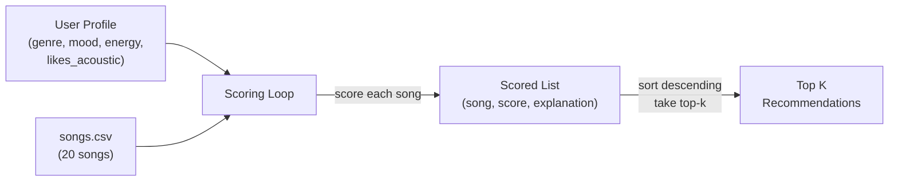

# 🎵 Music Recommender Simulation

## Project Summary

In this project you will build and explain a small music recommender system.

Your goal is to:

- Represent songs and a user "taste profile" as data
- Design a scoring rule that turns that data into recommendations
- Evaluate what your system gets right and wrong
- Reflect on how this mirrors real world AI recommenders

This simulation implements a content-based music recommender that scores songs against a user's taste profile using weighted proximity matching. Given an expanded catalog of 20 songs spanning 14 genres, it computes a similarity score for each track and returns the top recommendations with plain-language explanations of why each song was chosen.

---

## How The System Works

Real-world recommenders like Spotify and YouTube Music combine two strategies: **collaborative filtering** (finding users with similar listening behavior and recommending what they enjoy) and **content-based filtering** (analyzing a song's audio features and metadata to find similar tracks). Our simulation focuses on the content-based approach, since we have a small catalog without multi-user interaction data.

### Data Flow



The system works in two stages:

1. **Scoring Rule (per song)** — For each song, compute how well it matches the user's preferences using this formula:

   ```
   total = (0.25 * genre_match)
         + (0.20 * mood_match)
         + (0.20 * energy_proximity)
         + (0.15 * acousticness_score)
         + (0.10 * danceability_proximity)
         + (0.10 * valence_proximity)
   ```

   - **Categorical features** (genre, mood): score 1.0 on exact match, 0.0 otherwise.
   - **Numeric features** (energy, danceability, valence): use proximity scoring `1 - |song_value - user_target|` so songs *closer* to the user's preference are rewarded, not just the highest or lowest values.
   - **Acousticness**: if `likes_acoustic` is True, use `song.acousticness` directly; if False, use `1 - song.acousticness` (rewards electronic production).

2. **Ranking Rule (across catalog)** — Apply the scoring rule to every song, sort by score descending, return the top-k results with explanations.

### Song Features

Each `Song` object carries these attributes from `data/songs.csv`:

| Feature | Type | Description |
|---|---|---|
| `genre` | categorical | Style category — now includes: pop, lofi, rock, ambient, jazz, synthwave, indie pop, hip-hop, classical, electronic, r&b, country, metal, reggae, folk, latin, blues |
| `mood` | categorical | Emotional tone — now includes: happy, chill, intense, relaxed, moody, focused, romantic, nostalgic, aggressive, melancholy, sad |
| `energy` | float 0–1 | Perceived intensity and activity level |
| `tempo_bpm` | float 60–170 | Beats per minute (normalized to 0–1 for scoring) |
| `valence` | float 0–1 | Musical positivity — happy/cheerful (high) vs. dark/sad (low) |
| `danceability` | float 0–1 | How suitable the track is for dancing |
| `acousticness` | float 0–1 | Acoustic vs. electronic production character |

### UserProfile Preferences

Each `UserProfile` stores four preference signals:

| Field | Type | Maps To | Why It Matters |
|---|---|---|---|
| `favorite_genre` | string | Exact match against `Song.genre` | Gates the broadest stylistic preference |
| `favorite_mood` | string | Exact match against `Song.mood` | Captures situational emotional intent |
| `target_energy` | float 0–1 | Proximity score against `Song.energy` | Separates "chill lofi" (0.4) from "intense rock" (0.9) |
| `likes_acoustic` | bool | Compared against `Song.acousticness` | Distinguishes organic from electronic production |

**Can this profile differentiate "intense rock" from "chill lofi"?** Yes — these two archetypes differ on every field: genre (rock vs. lofi), mood (intense vs. chill), target_energy (0.9 vs. 0.4), and likes_acoustic (False vs. True). The profile provides four independent axes of separation, which is sufficient for a catalog of this size. A limitation is that users with mixed tastes (e.g., someone who likes *both* chill lofi and intense rock) cannot be fully represented with a single-preference profile.

### Algorithm Recipe (Scoring Weights)

| Feature | Weight | Points Equivalent | Rationale |
|---|---|---|---|
| Genre match | 0.25 | +2.5 pts | Strongest signal — genre loyalty is structural. A jazz fan rarely wants metal. |
| Mood match | 0.20 | +2.0 pts | Core vibe indicator, but more situational than genre. |
| Energy proximity | 0.20 | up to +2.0 pts | Primary numeric proxy for how a song *feels*. Gradual, not binary. |
| Acousticness | 0.15 | up to +1.5 pts | Production style; maps directly to `likes_acoustic`. |
| Danceability | 0.10 | up to +1.0 pts | Refines active vs. passive listening context. |
| Valence | 0.10 | up to +1.0 pts | Positivity nuance; partially overlaps with mood. |
| **Max possible** | **1.00** | **10.0 pts** | |

### Expected Biases and Limitations

- **Genre dominance**: At 25% weight, genre is the single strongest factor. A song that matches genre but misses on mood/energy can still outscore a perfect mood+energy match in a different genre. This mirrors real listener behavior (genre loyalty is strong) but can suppress cross-genre discovery.
- **Single-preference profile**: The `UserProfile` stores one genre and one mood. Users with eclectic tastes (e.g., "chill lofi for studying, intense metal for workouts") are poorly served — the system can only optimize for one context at a time.
- **Catalog bias**: With only 20 songs, some genres have just one representative. A user who prefers hip-hop will only ever get one strong match, regardless of how the weights are tuned.
- **No temporal context**: The system doesn't know *when* the user is listening. Real recommenders adapt to time of day, activity, and recent listening history.
- **Binary categorical matching**: Genre and mood are all-or-nothing (1.0 or 0.0). There's no notion of genre similarity (e.g., "indie pop" being close to "pop"), which penalizes near-misses as harshly as total mismatches.

### CLI Output

Below is a screenshot of the recommender running with the default pop/happy user profile:


---

## Getting Started

### Setup

1. Create a virtual environment (optional but recommended):

   ```bash
   python -m venv .venv
   source .venv/bin/activate      # Mac or Linux
   .venv\Scripts\activate         # Windows

2. Install dependencies

```bash
pip install -r requirements.txt
```

3. Run the app:

```bash
python -m src.main
```

### Running Tests

Run the starter tests with:

```bash
pytest
```

You can add more tests in `tests/test_recommender.py`.

---

## Experiments You Tried

Below is a recording of all 6 user profiles running through the recommender:


### Weight Shift: Genre halved (0.25 to 0.125), Energy doubled (0.20 to 0.40)

Key observations from the experiment:

- **High-Energy Pop profile:** Fuego Lento (latin, happy) jumped from #3 to #2, overtaking Gym Hero (pop, intense). With genre worth less, the perfect energy match (1.00) mattered more than pop loyalty. This made recommendations feel more "activity-based" — good for a workout playlist, but less genre-coherent.
- **Deep Intense Rock profile:** Gym Hero (pop) closed the gap with Storm Runner (rock) significantly — from a 0.20 gap down to 0.08. The genre wall between pop and rock was nearly erased.
- **Conflicted profile (blues, sad, energy 0.9):** Broken Strings stayed #1 but its lead shrank. High-energy songs from unrelated genres (Gym Hero, Fuego Lento) climbed into the top 5, pulled by the doubled energy weight. The system was "torn" between genre/mood loyalty and the energy target.

**Conclusion:** The original weights favor genre-coherent recommendations. The experimental weights favor energy-coherent recommendations. Neither is objectively better — it depends on whether the user cares more about *what kind* of music they hear or *how it feels*.

### Profile Comparisons

- **High-Energy Pop vs. Chill Lofi:** These two profiles share zero overlap in their top 5. The pop profile gets Sunrise City (0.96) and Gym Hero (0.76); the lofi profile gets Library Rain (0.93) and Midnight Coding (0.91). This confirms the system can cleanly separate high-energy upbeat listeners from low-energy mellow listeners — the 4 preference axes (genre, mood, energy, acoustic) provide enough separation.
- **Deep Intense Rock vs. High-Energy Pop:** Both profiles have high energy targets (0.9 and 0.8), yet their top results barely overlap. Storm Runner (#1 for rock) doesn't appear in pop's top 5, and Sunrise City (#1 for pop) drops to #4 for rock. Genre is the differentiator here — without it, these profiles would converge on the same high-energy songs.
- **Middle of the Road vs. Chill Lofi:** The R&B profile (energy 0.5) and lofi profile (energy 0.4) are only 0.1 apart on energy, yet produce completely different top 5 lists. Genre and mood do the heavy lifting — the system doesn't just sort by energy.

---

## Limitations and Risks

- **Tiny catalog (20 songs):** Most genres have only one representative, so there is zero within-genre variety. A blues fan always gets Broken Strings at #1.
- **Binary categorical matching:** "Indie pop" and "pop" score 0 similarity. There is no concept of genre distance, so near-misses are penalized as harshly as total mismatches.
- **Mood labels carry energy assumptions:** "Sad" is paired with low energy (blues, 0.48) in the data, but intense sad music exists (dark electronic, heavy emo). The system can't find what isn't labeled.
- **Single-preference profile:** Users with mixed or contextual tastes (chill lofi for studying, metal for the gym) can only be served one context at a time.
- **No lyric, language, or cultural understanding:** The system treats songs as numeric vectors. It doesn't know that "Coffee Shop Stories" is in English or that "Fuego Lento" implies a Spanish-language track.

---

## Reflection

[**Model Card**](model_card.md)

Recommenders turn data into predictions by reducing each song and user to a set of comparable numbers, then using a distance or similarity formula to rank every option. The scoring formula is deceptively simple — multiply, subtract, add — but the *weights* control everything. Doubling energy's weight completely reshuffled rankings even though the underlying data didn't change. This means whoever chooses the weights has enormous power over what users see, which is an invisible form of editorial control.

Bias shows up at multiple levels: in the data (which genres are represented, who assigned the mood labels), in the features (what gets measured and what doesn't), and in the weights (what the system prioritizes). The "Conflicted: High Energy + Sad" experiment was the clearest example — the system couldn't serve this user well not because the algorithm is broken, but because the dataset assumes sadness is quiet. In a real product with millions of users, these small assumptions scale into systematic blind spots that shape what entire communities of listeners are exposed to.

