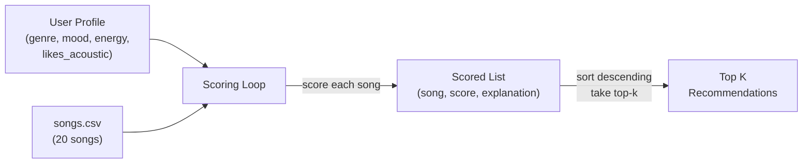
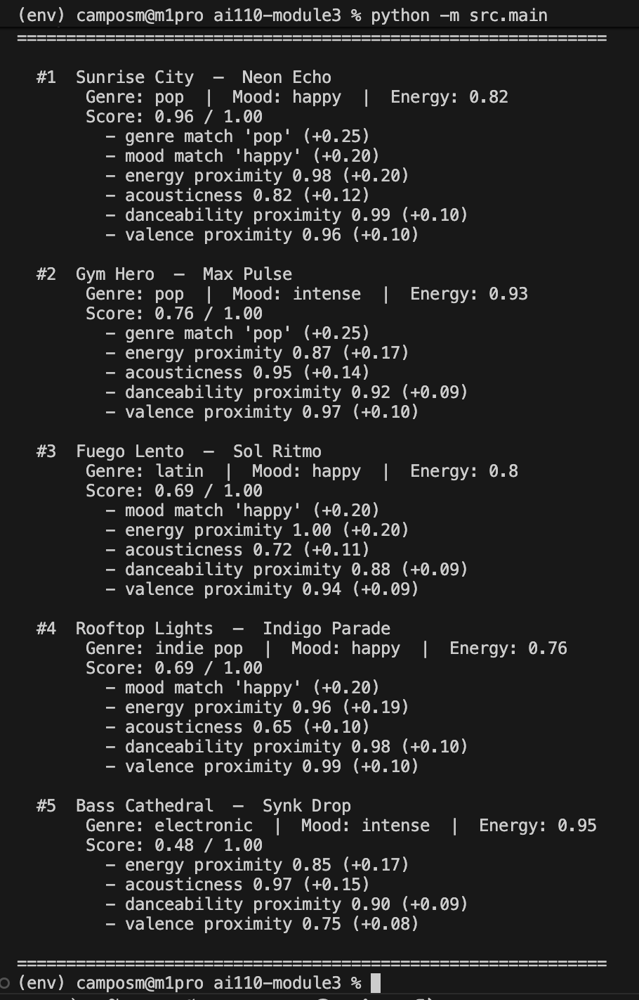

# 🎵 Music Recommender Simulation

## Project Summary

In this project you will build and explain a small music recommender system.

Your goal is to:

- Represent songs and a user "taste profile" as data
- Design a scoring rule that turns that data into recommendations
- Evaluate what your system gets right and wrong
- Reflect on how this mirrors real world AI recommenders

This simulation implements a content-based music recommender that scores songs against a user's taste profile using weighted proximity matching. Given an expanded catalog of 20 songs spanning 14 genres, it computes a similarity score for each track and returns the top recommendations with plain-language explanations of why each song was chosen.

---

## How The System Works

Real-world recommenders like Spotify and YouTube Music combine two strategies: **collaborative filtering** (finding users with similar listening behavior and recommending what they enjoy) and **content-based filtering** (analyzing a song's audio features and metadata to find similar tracks). Our simulation focuses on the content-based approach, since we have a small catalog without multi-user interaction data.

### Data Flow



The system works in two stages:

1. **Scoring Rule (per song)** — For each song, compute how well it matches the user's preferences using this formula:

   ```
   total = (0.25 * genre_match)
         + (0.20 * mood_match)
         + (0.20 * energy_proximity)
         + (0.15 * acousticness_score)
         + (0.10 * danceability_proximity)
         + (0.10 * valence_proximity)
   ```

   - **Categorical features** (genre, mood): score 1.0 on exact match, 0.0 otherwise.
   - **Numeric features** (energy, danceability, valence): use proximity scoring `1 - |song_value - user_target|` so songs *closer* to the user's preference are rewarded, not just the highest or lowest values.
   - **Acousticness**: if `likes_acoustic` is True, use `song.acousticness` directly; if False, use `1 - song.acousticness` (rewards electronic production).

2. **Ranking Rule (across catalog)** — Apply the scoring rule to every song, sort by score descending, return the top-k results with explanations.

### Song Features

Each `Song` object carries these attributes from `data/songs.csv`:

| Feature | Type | Description |
|---|---|---|
| `genre` | categorical | Style category — now includes: pop, lofi, rock, ambient, jazz, synthwave, indie pop, hip-hop, classical, electronic, r&b, country, metal, reggae, folk, latin, blues |
| `mood` | categorical | Emotional tone — now includes: happy, chill, intense, relaxed, moody, focused, romantic, nostalgic, aggressive, melancholy, sad |
| `energy` | float 0–1 | Perceived intensity and activity level |
| `tempo_bpm` | float 60–170 | Beats per minute (normalized to 0–1 for scoring) |
| `valence` | float 0–1 | Musical positivity — happy/cheerful (high) vs. dark/sad (low) |
| `danceability` | float 0–1 | How suitable the track is for dancing |
| `acousticness` | float 0–1 | Acoustic vs. electronic production character |

### UserProfile Preferences

Each `UserProfile` stores four preference signals:

| Field | Type | Maps To | Why It Matters |
|---|---|---|---|
| `favorite_genre` | string | Exact match against `Song.genre` | Gates the broadest stylistic preference |
| `favorite_mood` | string | Exact match against `Song.mood` | Captures situational emotional intent |
| `target_energy` | float 0–1 | Proximity score against `Song.energy` | Separates "chill lofi" (0.4) from "intense rock" (0.9) |
| `likes_acoustic` | bool | Compared against `Song.acousticness` | Distinguishes organic from electronic production |

**Can this profile differentiate "intense rock" from "chill lofi"?** Yes — these two archetypes differ on every field: genre (rock vs. lofi), mood (intense vs. chill), target_energy (0.9 vs. 0.4), and likes_acoustic (False vs. True). The profile provides four independent axes of separation, which is sufficient for a catalog of this size. A limitation is that users with mixed tastes (e.g., someone who likes *both* chill lofi and intense rock) cannot be fully represented with a single-preference profile.

### Algorithm Recipe (Scoring Weights)

| Feature | Weight | Points Equivalent | Rationale |
|---|---|---|---|
| Genre match | 0.25 | +2.5 pts | Strongest signal — genre loyalty is structural. A jazz fan rarely wants metal. |
| Mood match | 0.20 | +2.0 pts | Core vibe indicator, but more situational than genre. |
| Energy proximity | 0.20 | up to +2.0 pts | Primary numeric proxy for how a song *feels*. Gradual, not binary. |
| Acousticness | 0.15 | up to +1.5 pts | Production style; maps directly to `likes_acoustic`. |
| Danceability | 0.10 | up to +1.0 pts | Refines active vs. passive listening context. |
| Valence | 0.10 | up to +1.0 pts | Positivity nuance; partially overlaps with mood. |
| **Max possible** | **1.00** | **10.0 pts** | |

### Expected Biases and Limitations

- **Genre dominance**: At 25% weight, genre is the single strongest factor. A song that matches genre but misses on mood/energy can still outscore a perfect mood+energy match in a different genre. This mirrors real listener behavior (genre loyalty is strong) but can suppress cross-genre discovery.
- **Single-preference profile**: The `UserProfile` stores one genre and one mood. Users with eclectic tastes (e.g., "chill lofi for studying, intense metal for workouts") are poorly served — the system can only optimize for one context at a time.
- **Catalog bias**: With only 20 songs, some genres have just one representative. A user who prefers hip-hop will only ever get one strong match, regardless of how the weights are tuned.
- **No temporal context**: The system doesn't know *when* the user is listening. Real recommenders adapt to time of day, activity, and recent listening history.
- **Binary categorical matching**: Genre and mood are all-or-nothing (1.0 or 0.0). There's no notion of genre similarity (e.g., "indie pop" being close to "pop"), which penalizes near-misses as harshly as total mismatches.

### CLI Output

Below is a screenshot of the recommender running with the default pop/happy user profile:



---

## Getting Started

### Setup

1. Create a virtual environment (optional but recommended):

   ```bash
   python -m venv .venv
   source .venv/bin/activate      # Mac or Linux
   .venv\Scripts\activate         # Windows

2. Install dependencies

```bash
pip install -r requirements.txt
```

3. Run the app:

```bash
python -m src.main
```

### Running Tests

Run the starter tests with:

```bash
pytest
```

You can add more tests in `tests/test_recommender.py`.

---

## Experiments You Tried

Use this section to document the experiments you ran. For example:

- What happened when you changed the weight on genre from 2.0 to 0.5
- What happened when you added tempo or valence to the score
- How did your system behave for different types of users

---

## Limitations and Risks

Summarize some limitations of your recommender.

Examples:

- It only works on a tiny catalog
- It does not understand lyrics or language
- It might over favor one genre or mood

You will go deeper on this in your model card.

---

## Reflection

Read and complete `model_card.md`:

[**Model Card**](model_card.md)

Write 1 to 2 paragraphs here about what you learned:

- about how recommenders turn data into predictions
- about where bias or unfairness could show up in systems like this


---

## 7. `model_card_template.md`

Combines reflection and model card framing from the Module 3 guidance. :contentReference[oaicite:2]{index=2}  

```markdown
# 🎧 Model Card - Music Recommender Simulation

## 1. Model Name

Give your recommender a name, for example:

> VibeFinder 1.0

---

## 2. Intended Use

- What is this system trying to do
- Who is it for

Example:

> This model suggests 3 to 5 songs from a small catalog based on a user's preferred genre, mood, and energy level. It is for classroom exploration only, not for real users.

---

## 3. How It Works (Short Explanation)

Describe your scoring logic in plain language.

- What features of each song does it consider
- What information about the user does it use
- How does it turn those into a number

Try to avoid code in this section, treat it like an explanation to a non programmer.

---

## 4. Data

Describe your dataset.

- How many songs are in `data/songs.csv`
- Did you add or remove any songs
- What kinds of genres or moods are represented
- Whose taste does this data mostly reflect

---

## 5. Strengths

Where does your recommender work well

You can think about:
- Situations where the top results "felt right"
- Particular user profiles it served well
- Simplicity or transparency benefits

---

## 6. Limitations and Bias

Where does your recommender struggle

Some prompts:
- Does it ignore some genres or moods
- Does it treat all users as if they have the same taste shape
- Is it biased toward high energy or one genre by default
- How could this be unfair if used in a real product

---

## 7. Evaluation

How did you check your system

Examples:
- You tried multiple user profiles and wrote down whether the results matched your expectations
- You compared your simulation to what a real app like Spotify or YouTube tends to recommend
- You wrote tests for your scoring logic

You do not need a numeric metric, but if you used one, explain what it measures.

---

## 8. Future Work

If you had more time, how would you improve this recommender

Examples:

- Add support for multiple users and "group vibe" recommendations
- Balance diversity of songs instead of always picking the closest match
- Use more features, like tempo ranges or lyric themes

---

## 9. Personal Reflection

A few sentences about what you learned:

- What surprised you about how your system behaved
- How did building this change how you think about real music recommenders
- Where do you think human judgment still matters, even if the model seems "smart"

